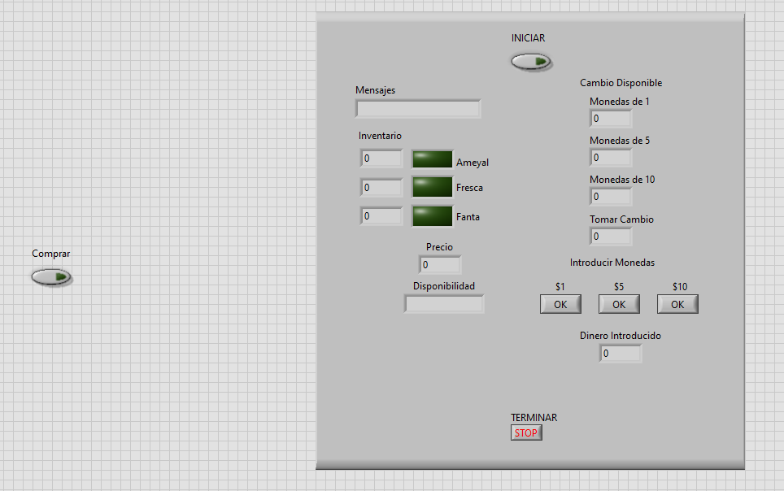
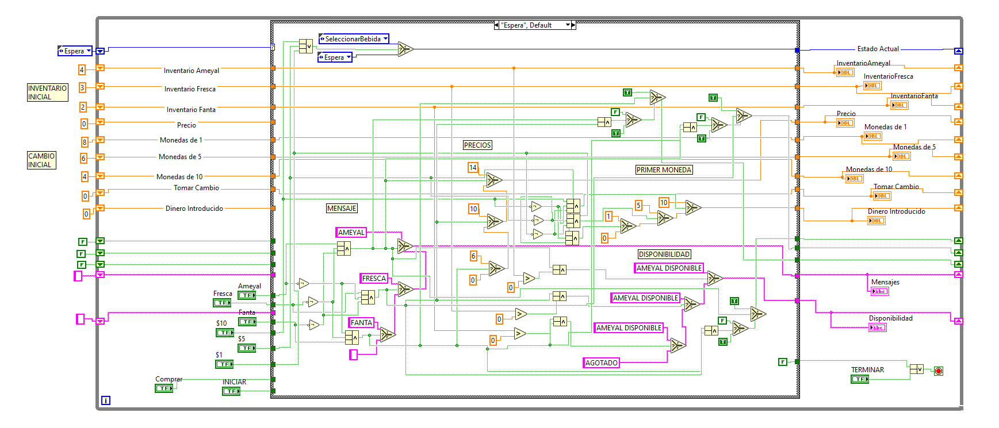

<br />
<div align="center">
	<h3 align="center">NI LabVIEW Projects</h3>
	<p align="center">
    	Repository containing various LabVIEW scripts and general instrumentation projects.
  	</p>
</div>

## Installation

1. Install [LabVIEW](https://www.ni.com/en-us/support/downloads/software-products/download.labview.html), at least version 2020.
2. Clone the repo
   ```sh
   git clone https://github.com/DarioArzaba/LabVIEWInstrumentationOpen.git
   cd LabVIEWInstrumentationOpen
   ```
3. Go `cd` to the directory that picks your interest.
4. Open the `lvproj` files when available, then run the standalone `vi` files. 
5. Some projects require additional `VI Package Manager` support packages:
	1. I2C Implementation in LabVIEW FPGA-1.0.0.2
	1. I2C&SPI API-3.0.0.22
	1. LabVIEW Interface for Arduino-2.2.0.79
	1. NI CompactRIO Information (CRI) Library-2015.0.0.1
	1. NI CompactRIO Waveform Library-4.1.0.9
	1. X-Modules for myRIO-1.0.0.1

## Usage

The list of programs right now for me is too long to describe in detail, but hopefully when I have time I will do a comprehensive list with proper images and usage instructions, for now we can see in the fallowing images the Frontend and Backend of a vending machine simulation `VendingMachineEXAMPLE\VendingMachine.vi`: 

</br>
<div align="center"> <p> E.g Logic behind a vending machine (Block Diagrams) </p> </div>

</br>
<div align="center"> <p> Vending Machine Frontend with various possible states </p> </div>


## Roadmap

- [x] Organize scripts into descriptive folders
- [ ] Update Repo
    - [ ] Add individual usage explanations and expected output
    - [ ] Fix missing libraries and modules errors

## License

Distributed under the [MIT License](https://mit-license.org/).

## Contact

Dario Arzaba - dario.arzaba@gmail.com